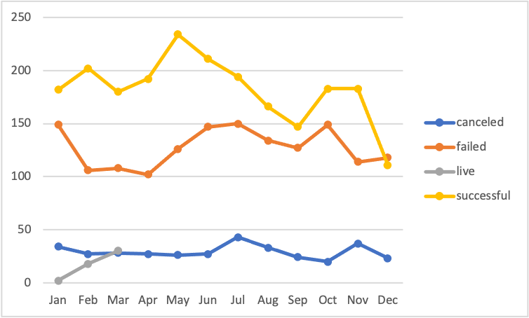

# An Analysis of Kickstarter Campaigns
## Module 1 trend analysis using an excel dataset of 4000+ crowdfunding campaigns. 
---

---
It's clear that Kickstarters launched in summer months of June and July are most likely to meet their fundraising goals. For this reason, we recommend that you plan to launch your campaign in June. 
